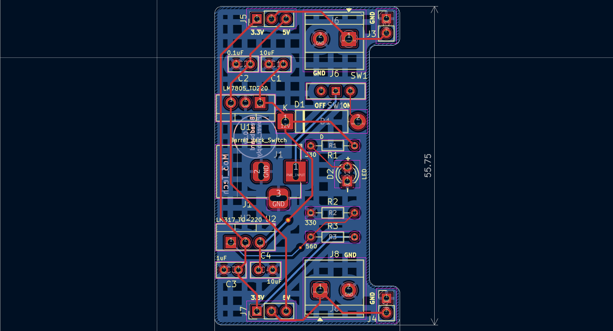

# 🔌 Breadboard Power Supply Module (5V / 3.3V)

A compact and reliable **breadboard power supply module** that provides **regulated 5V and 3.3V outputs** from a 12V DC input.  
This project is designed for electronics prototyping, embedded systems development, and educational applications.

---

## 📖 Overview

This board converts a 12V DC input into stable 5V and 3.3V power rails using linear voltage regulators.  
It is optimized to plug directly into a standard breadboard, allowing quick and safe powering of microcontrollers, sensors, and peripheral circuits during development and testing.

---

## ⚙️ Features

- 12V DC input via barrel jack  
- Regulated **5V output using LM7805**  
- Regulated **3.3V output using LM317**  
- Jumper-based voltage selection (5V / 3.3V)  
- Reverse polarity protection diode  
- Power ON LED indicator  
- Breadboard-compatible pin headers  
- Screw terminal outputs for external connections  

---

## 🧠 Circuit Description

- The **LM7805** regulator provides a fixed 5V output with input and output decoupling capacitors to ensure voltage stability.  
- The **LM317** adjustable regulator is configured to output 3.3V using a resistor divider network.  
- A protection diode prevents damage caused by incorrect input polarity.  
- An LED with a current-limiting resistor indicates when the board is powered.

---

## 🛠️ Tools & Components

- **EDA Software:** KiCad  
- **Voltage Regulators:** LM7805, LM317  
- **Input Connector:** DC Barrel Jack  
- **Outputs:** Pin headers and screw terminals  

---

## 🚀 Applications

- Breadboard prototyping  
- Powering Arduino, STM32, ESP32, and AVR projects  
- Embedded systems testing  
- Educational electronics labs  

---
### 2D Layout & Routing
  

### 3D Render
  
            (Screenshot 2026-02-03 225950.png)

## 📂 Project Structure

```text
├── Schematic/
├── PCB/
├── 3D_View/
├── Images/
└── README.md
