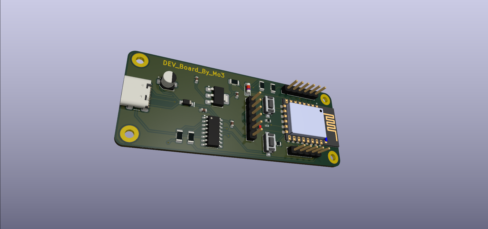

# DEV_Board_By_Mo3 (ESP8266-12E)

A custom-designed, high-performance development board based on the **ESP-12E (ESP8266)** module. This board features a modern **USB-C** interface and is designed for seamless prototyping with integrated power regulation and USB-to-TTL conversion.

---

## 🚀 Key Features

* **Core Microcontroller:** ESP8266-12E module with integrated PCB antenna.
* **Modern Interface:** USB-C 16-pin receptacle for power and programming.
* **Stable Power:** AMS1117-3.3V LDO regulator providing consistent 3.3V power from the 5V USB input.
* **USB-to-Serial:** Integrated CH340C bridge chip for plug-and-play serial communication.
* **Protection:** Includes a BZW55B3V3 Zener diode and decoupling capacitors for voltage stability and ESD protection.
* **Manual Controls:** Dedicated Flash (DTR/RTS logic) and Reset (SW_SPST) buttons for easy bootloader access.

---

## 🛠 Hardware Architecture

The board is logically divided into four main sections as defined in the schematics:

| Section | Components | Purpose |
| :--- | :--- | :--- |
| **Source** | AMS1117-3.3, BZW55B3V3, C1, C3 | Voltage regulation and power filtering. |
| **USB** | USB-C 16P, D2 Diode, C6 | Power input and basic surge protection. |
| **USB to TTL** | CH340C, C4, C5, R4, R5 | Bridge between PC USB and ESP8266 UART. |
| **ESP8266** | ESP-12E, Reset/Flash Switch, I/O Headers | Main processing, GPIO breakout, and boot mode selection. |

---

## 📐 Pinout & Connectivity

The board breaks out all essential GPIOs via two main headers:

* **Header J3:** GPIO12, GPIO13, GPIO14, GPIO15, GPIO16, and GND.
* **Header J4:** RESET, SCK, MOSI, MISO, and GND.
* **Header J5:** ADC and various ID pins for expanded peripheral support.

---

## 🖥️ Setup and Programming

1. **Driver Installation:** Ensure the **CH340 drivers** are installed on your computer.
2. **Arduino IDE Configuration:** * Add the ESP8266 board URL to your preferences.
   * Select **"NodeMCU 1.0 (ESP-12E Module)"** or **"Generic ESP8266 Module"**.
3. **Flashing:** Use the USB-C cable to connect to your PC. The board features an auto-reset circuit (DTR/RTS) for automatic flashing, but manual buttons are available if needed.

---

## 🖼️ Gallery

### 2D Layout & Routing
  
*Double-layer design with optimized ground pours for RF stability.*

### 3D Render

*Fully assembled view showing component placement and compact form factor.*

---

## 📜 License

This project is open-source. Feel free to use, modify, and distribute it for your own IoT applications.
